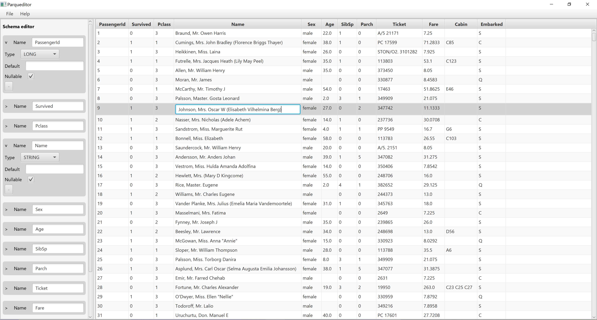

# Parqueditor

A JavaFx desktop application that lets you easily create and edit parquet files.

Open an existing parquet file or create it from scratch, you will be able to manage its schema and data.

